## Artem Kim

- USACO Platinum
- Codeforces rounds problemsetter ([Codeforces Round #892](https://codeforces.com/contest/1859), [Codeforces Round #932](https://codeforces.com/contest/1935))
- Codeforces Candidate Master [profile](https://codeforces.com/profile/i_love_penguins)

## Languages & Tools

### Frontend Technologies

### Backend Technologies

### Databases

### Tools

## Contact
- For any inquiries please contact [my email](mailto:me@artem-kim.com)
